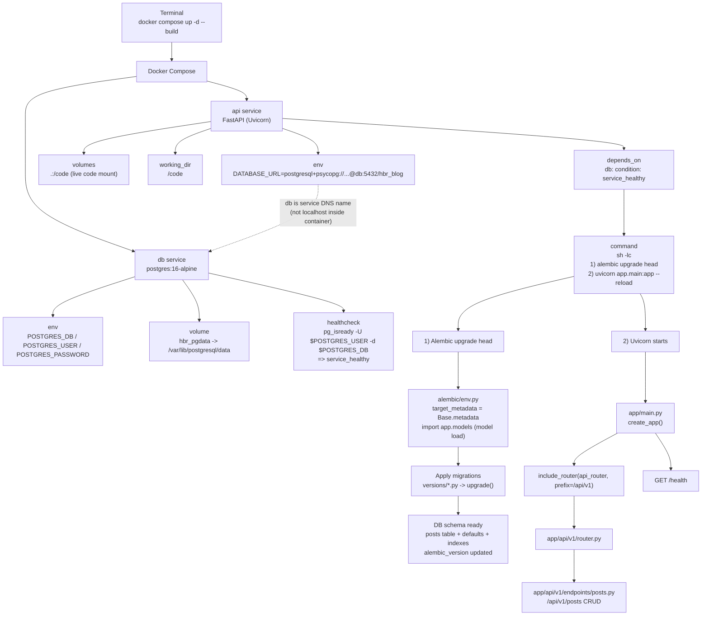

# HBR Blog Backend (FastAPI + Postgres + Docker Compose + Alembic)

블로그용 CRUD API 서버를 **FastAPI + SQLAlchemy + Postgres**로 구성하고,  
개발환경은 **Docker Compose**로 한 번에 실행되도록 세팅했습니다.

- API: FastAPI (Uvicorn)
- DB: Postgres 16 (alpine)
- Migration: Alembic
- Dev UX: 코드 볼륨 마운트 + `--reload`
- 컨테이너 시작 시 자동 마이그레이션: `alembic upgrade head`

---

## 프로젝트 구조

```bash
hbr_blog_be/
├─ app/
│  ├─ api/
│  │  └─ v1/
│  │     ├─ endpoints/
│  │     │  └─ posts.py
│  │     └─ router.py
│  ├─ core/
│  │  ├─ config.py
│  │  ├─ database.py
│  │  └─ security.py
│  ├─ models/
│  │  ├─ __init__.py
│  │  └─ post.py
│  └─ main.py
├─ alembic/
│  ├─ versions/
│  └─ env.py
├─ alembic.ini
├─ docker-compose.yml
├─ Dockerfile
├─ requirements.txt
└─ readme.md
```

## 요구사항
Docker Desktop (또는 Docker Engine)
Docker Compose v2
(선택) 로컬 psql / DBeaver 등 DB 클라이언트


## 실행 방법 (개발환경)
1) 빌드 & 실행 (재시작)
```bash
# 가장 안전한 재시작(환경변수/의존성까지 반영)
docker compose up -d --build
# 그냥 컨테이너만 재시작(코드 외 설정 변경이 없을 때)
docker compose restart api
```
2) 로그 확인
```bash
docker compose logs -f api
```
3) 상태 확인
```bash
docker compose ps
docker ps --format "table {{.Names}}\t{{.Image}}\t{{.Ports}}"
````


## 접속 URL
Swagger: http://localhost:8152/docs

Health: http://localhost:8152/health

MinIO API: http://localhost:9000

MinIO Console: http://localhost:9001

---

## Docker Compose 구성 요약

DB (Postgres)
- 이미지: `postgres:16-alpine`
- 컨테이너: `hbr-postgres`
- 포트: `5432:5432` (로컬에서 psql/DBeaver 접속용)
- 데이터: Docker volume `hbr_pgdata에` 저장
- healthcheck: `pg_isready`

API (FastAPI)
- 컨테이너: `hbr-blog-api`
- 포트: `8152:8000`
- 코드 마운트: `.:/code`
- 작업 디렉토리: `/code`
- DB 연결: `DATABASE_URL` 환경변수로 연결
- 시작 커맨드:
  - `alembic upgrade head`로 마이그레이션 자동 적용
- `uvicorn ... --reload`로 개발 편의성 확보

MinIO (S3 호환 스토리지)
- API 포트: `9000:9000`
- 콘솔: `9001:9001`
- 버킷: `MINIO_BUCKET`에 지정
- 공개 접근: `minio-init`에서 버킷에 public download 권한 설정

Redis + RQ Worker (썸네일 비동기 처리)
- Redis: `6379:6379`
- Worker: `rq worker $THUMBNAIL_QUEUE_NAME`

---

## Storage 설정 (로컬 MinIO 기준)
`.env`에 아래 값이 필요합니다.

```
STORAGE_BACKEND=s3
S3_ENDPOINT_URL=http://minio:9000
S3_BUCKET=hbr-uploads
S3_ACCESS_KEY=minioadmin
S3_SECRET_KEY=minioadmin123
S3_PUBLIC_BASE_URL=http://localhost:9000/hbr-uploads
```

로컬 파일 저장을 사용하려면 `STORAGE_BACKEND=local`로 바꾸고,
`PUBLIC_BASE_URL=http://localhost:8152`를 지정하면 됩니다.

## Thumbnail 비동기 처리 (RQ)
```
THUMBNAIL_PROCESSOR=rq
THUMBNAIL_QUEUE_NAME=thumbnails
THUMBNAIL_MAX_RETRIES=3
REDIS_URL=redis://redis:6379/0
```

---

## DB 접속 (psql)
1) 컨테이너로 접속
```bash
docker exec -it hbr-postgres psql -U hbr -d hbr_blog
````

2) 테이블 / 마이그레이션 상태 확인
```bash
\dt
\d posts
SELECT * FROM alembic_version;
````

## Alembic 마이그레이션 워크플로우

- 현재 마이그레이션 버전 확인
```
docker compose exec api alembic current
```

- 모델 변경 → 마이그레이션 파일 생성
```
docker compose exec api alembic revision --autogenerate -m "describe change"
```

- 마이그레이션 적용
```
docker compose exec api alembic upgrade head
```

- 한 단계 롤백
```
docker compose exec api alembic downgrade -1
```

---

## 현재 posts 테이블 스키마

posts 테이블은 아래 컬럼을 가집니다.

`id` (PK)

`title` (varchar 200)

`content` (text)

`is_published` (boolean, default false)

`is_deleted` (boolean, default false)

`created_at` (timestamp, default now())

`updated_at` (timestamp, default now())

---

## 프로젝트 흐름도 (Docker Compose → Alembic → FastAPI)



---

### To Do

- posts CRUD를 실제 DB 기반으로 완전 리팩토링(세션/레포지토리 패턴)
- soft delete(is_deleted) 정책 반영(list에서 제외 등)
- pagination / search / published 필터링
- 운영 환경 분리(prod compose / workers / reverse proxy)
